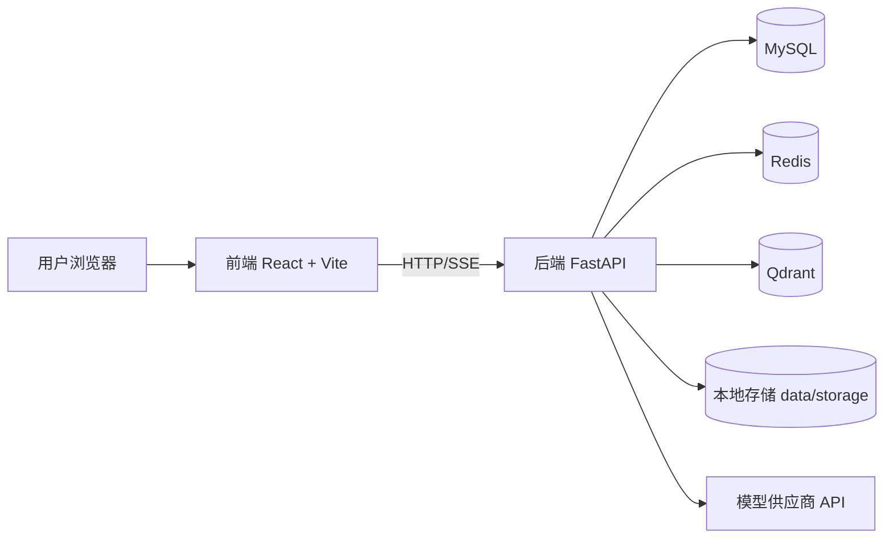
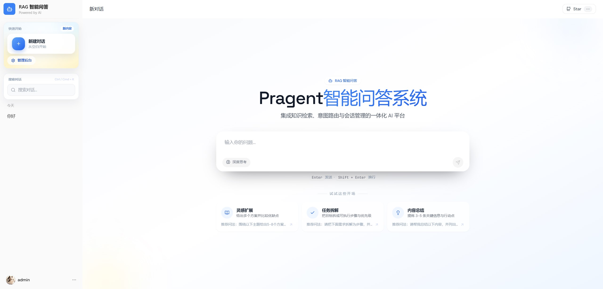
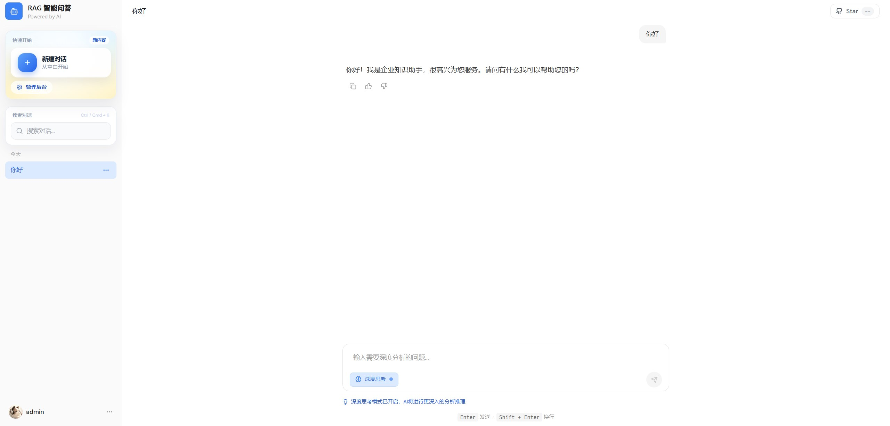

# Pragent

Pragent 是一个面向 RAG 场景的企业级全栈项目，包含：
- Python FastAPI 后端（会话、知识库、意图树、数据通道、追踪等）
- React + Vite 前端（聊天页与管理后台）
- MySQL / Redis / Qdrant 基础依赖（通过 Docker Compose 启动）

## 功能概览

- 聊天对话与会话管理
- RAG 检索问答
- 知识库与文档管理
- 意图树配置与意图节点管理
- 数据通道与任务处理
- 链路追踪与系统设置
- 示例问题管理

## 技术栈

后端：
- FastAPI
- SQLAlchemy Async + aiomysql
- Redis
- Qdrant

前端：
- React 18
- Vite 5
- TypeScript
- Radix UI + Tailwind CSS

部署与运行：
- Docker Compose
- Bash 启停脚本

## 项目结构

```text
pragent/
  backend/                # 后端服务
  frontend/               # 前端工程
  data/storage/           # 本地存储目录（运行时）
  Dockerfile              # 后端镜像构建
  docker-compose.yml      # 依赖与后端编排
  pyproject.toml          # 后端依赖与构建配置
  .env.example            # 环境变量模板
  .env                    # 本地环境变量
  start_all.sh            # 一键启动
  stop_all.sh             # 一键停止
```

## 快速开始（推荐）

### 1) 环境要求

- Linux / macOS（Windows 建议 WSL2）
- Docker + Docker Compose
- Node.js 18+ 与 npm

### 2) 一键启动

在项目根目录执行：

```bash
./start_all.sh
```

脚本会自动完成：
- 创建 `data/storage`
- 若不存在 `.env`，从 `.env.example` 复制
- 启动 `mysql` / `redis` / `qdrant` / `backend`
- 启动前端开发服务（5173）

启动后访问：
- 前端：http://localhost:5173
- 后端：http://localhost:9090
- 健康检查：http://localhost:9090/healthz

### 3) 一键停止

```bash
./stop_all.sh
```

## 手动启动（可选）

### 后端依赖与服务

```bash
docker compose up -d mysql redis qdrant backend
```

### 前端

```bash
cd frontend
npm install
npm run dev -- --host 0.0.0.0 --port 5173
```

## 环境变量说明

主要配置在 `.env`（参考 `.env.example`）：

- 基础服务
  - `APP_PORT`（默认 9090）
  - `API_PREFIX`（默认 `/api/pragent`）
- 基础依赖
  - `DATABASE_URL`
  - `REDIS_URL`
  - `QDRANT_URL`
- 模型与推理
  - `OPENAI_*`
  - `DEEPSEEK_*`
  - `SILICONFLOW_*`
  - `ANTHROPIC_*`
- RAG 行为参数
  - `RAG_*` 系列配置

## 常见问题

### 1) 前端报模块缺失或类型报红

在 `frontend` 目录重新安装依赖：

```bash
npm install
```

### 2) Docker 启动失败

- 确认 Docker 服务已启动
- 检查端口占用：`9090`、`5173`、`3306`、`6379`、`6333`
- 使用 `docker compose logs backend` 查看后端日志


## 架构概览



### 核心数据流

1. 用户在前端发起问题。
2. 后端完成鉴权、会话管理、意图判断与检索。
3. 检索结果与上下文送入模型生成答案。
4. 结果通过 SSE/流式返回前端，并写入会话历史与追踪数据。

## API 入口速览

后端统一前缀默认是 `/api/pragent`。

- 鉴权：`/auth/*`
- 用户：`/users/*`
- 会话：`/conversations/*`
- 知识库：`/knowledge/*`
- 数据通道：`/ingestion/*`
- 意图树：`/intent-tree/*`
- 示例问题：`/sample-questions/*` 和 `/rag/sample-questions`
- 链路追踪：`/traces/*`
- 设置与看板：`/settings/*`、`/dashboard/*`
- RAG 聊天：`/rag/*`

健康检查：`/healthz`

## 页面展示

-首页

-对话页


## 贡献说明

1. Fork 仓库并创建特性分支。
2. 提交前确保前端可构建、后端可启动。
3. 提交信息建议使用动词开头（例如 `fix:`, `feat:`, `refactor:`）。
4. 提交 PR 时描述变更动机、影响范围和验证方式。
